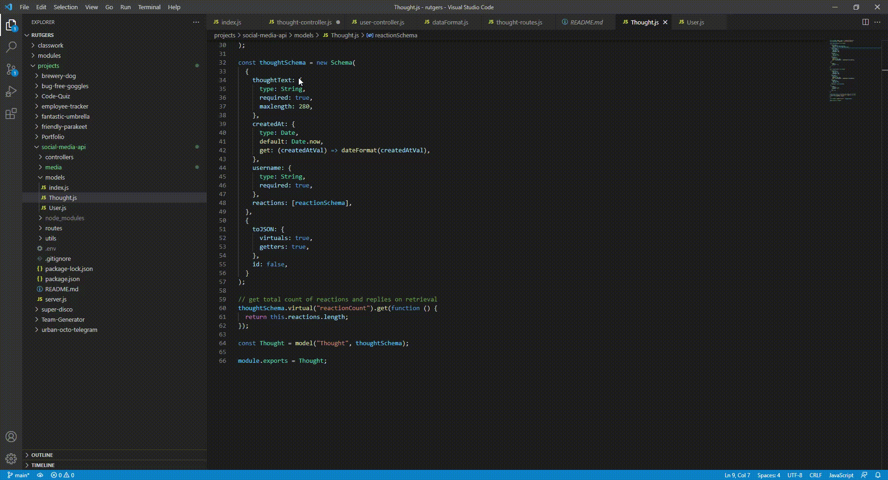

# Social Media API

## Made With
  * JavaScript
  * Node
  * NPM
  * Express.js
  * Mongoose
  * MongoDB

# Description
This is a database with noSQL using MongoDB to make API endpoints. This database is designed for a social media platform and uses users, thoughts, and reactions.

# Walkthrough Video

